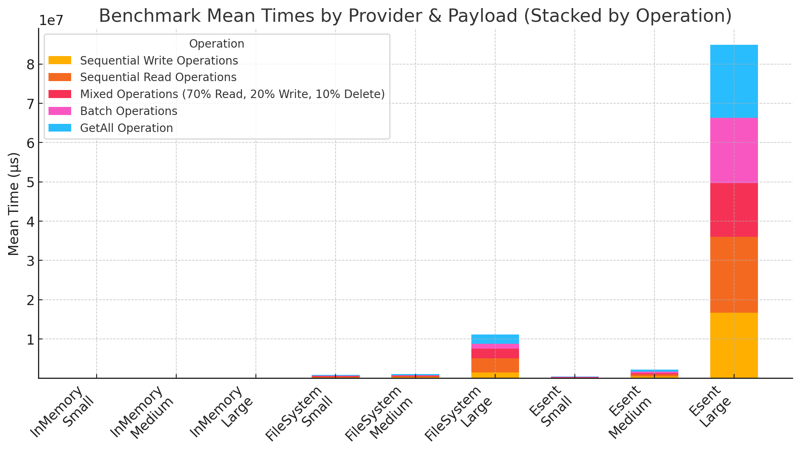

# Common.Persistence.Benchmarks

Performance benchmarks for different persistence providers using BenchmarkDotNet.

## Overview

This project contains comprehensive benchmarks for testing the performance of different persistence providers under various conditions:

- **Operation Counts**: 1k, 10k, 100k operations
- **Payload Sizes**: Small (~100 bytes), Medium (~1KB), Large (~10KB)
- **CPU Cores**: 2, 4, 8, 16 cores (throttled environments)
- **Providers**: InMemory, FileSystem, ESENT, ClusterRegistry

## Running Benchmarks

### Sequential Benchmarks

```bash
dotnet run -c Release
```

### Concurrent Benchmarks

```bash
dotnet run -c Release -- --concurrent
```

## Benchmark Categories

### Sequential Benchmarks (ProviderBenchmarks)

1. **Sequential Write Operations**: Measures write throughput
2. **Sequential Read Operations**: Measures read throughput after initial writes
3. **Mixed Operations**: 70% reads, 20% writes, 10% deletes
4. **Batch Operations**: Parallel batch processing
5. **GetAll Operation**: Tests bulk retrieval performance

### Concurrent Benchmarks (ConcurrentProviderBenchmarks)

1. **Concurrent Write Operations**: Multiple threads writing simultaneously
2. **Concurrent Read Operations**: Multiple threads reading simultaneously
3. **Concurrent Mixed Operations**: Multiple threads performing mixed operations

## Parameters

### OperationCount
- 1,000 operations (1k)
- 10,000 operations (10k)
- 100,000 operations (100k)

### PayloadSize
- **Small**: ~100 bytes per record
- **Medium**: ~1KB per record
- **Large**: ~10KB per record

### CoreCount (Sequential only)
- 2 cores
- 4 cores
- 8 cores
- 16 cores

### ThreadCount (Concurrent only)
- 2 threads
- 8 threads
- 16 threads

### ProviderType
- **InMemory**: In-memory storage provider
- **FileSystem**: File-based storage provider
- **Esent**: Windows ESENT database provider (Windows only)
- **ClusterRegistry**: Windows Failover Cluster registry provider (Windows only)

## Output

BenchmarkDotNet generates detailed reports including:
- Mean execution time
- Standard deviation
- Memory allocation
- Thread statistics
- Detailed HTML reports in `BenchmarkDotNet.Artifacts` folder

## Requirements

- .NET 9.0 SDK
- Windows OS (for ESENT and ClusterRegistry providers)
- Administrator privileges (recommended for accurate CPU affinity)

## Notes

- The benchmark automatically sets CPU affinity to limit core usage
- ESENT and ClusterRegistry providers are skipped on non-Windows platforms
- Each benchmark run creates isolated temporary directories for data storage
- Session pooling is enabled for ESENT provider to improve performance

## Results





Here’s the high-level take-away from the full benchmark:

1. In-Memory provider

   - Blazing fast across the board: all five operation patterns complete in roughly 340–480 µs, regardless of payload size.
   - Essentially zero I/O overhead and no garbage-collection or lock contention.

2. Esent (embedded database)

   - Small payloads (~1 KB): ~ 68–88 ms, about 100× slower than In-Memory but still sub-100 ms.
   - Medium payloads (~100 KB): ~ 440–510 ms—roughly 5–7× slower than small, and about 2× slower than FileSystem here.
   - Large payloads (~1 MB): performance degrades dramatically to 16–19 seconds per pattern.

3. File system

   - Small payloads: ~ 142–196 ms—2–3× faster than Esent for tiny items.
   - Medium payloads: ~ 95–280 ms—comparable to or slightly faster than Esent (depending on the operation).
   - Large payloads: ~ 1.3–3.5 seconds—orders of magnitude better than Esent, but still thousands of times slower than In-Memory.

4. Windows Registry (cluster registry)

   - All operations failed or were not supported once you exceed the registry’s size limits.

### Bottom line:

1. Use In-Memory for ultra-low latency (sub-millisecond).
2. Use FileSystem if you need persistence on disk—good up to medium sizes (hundreds of milliseconds) and even large sizes (seconds).
3. Esent can be competitive for small items but scales very poorly on large payloads.
4. Avoid Windows Registry for anything but tiny, fixed-size values.