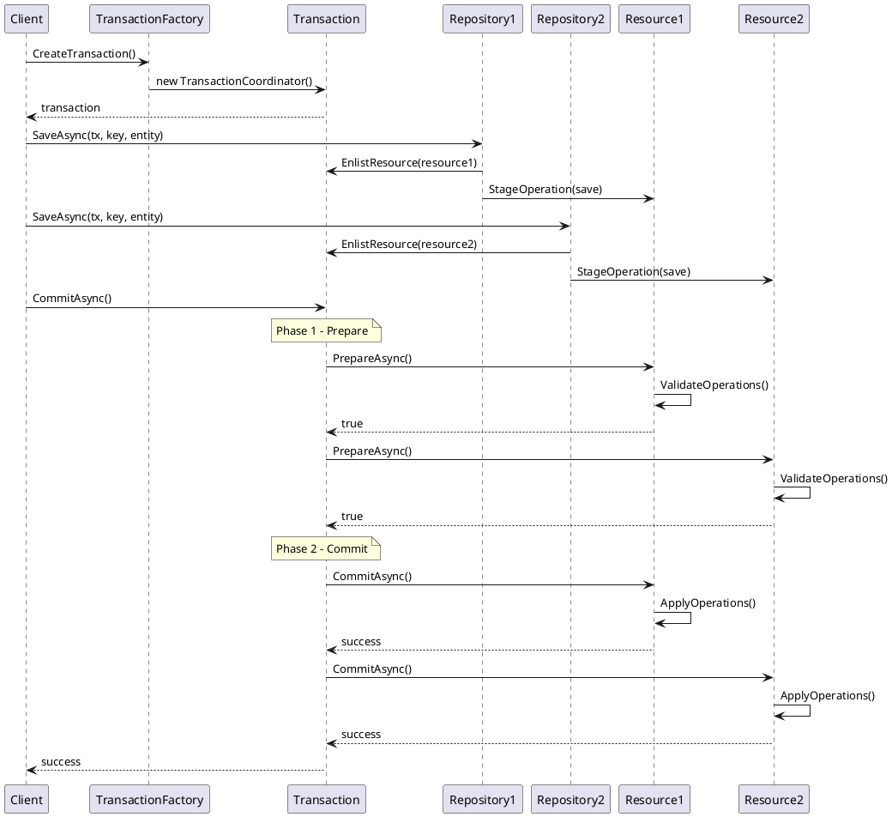
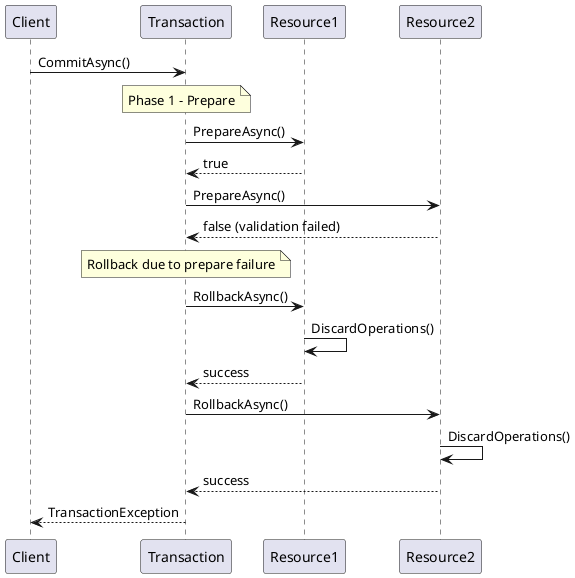
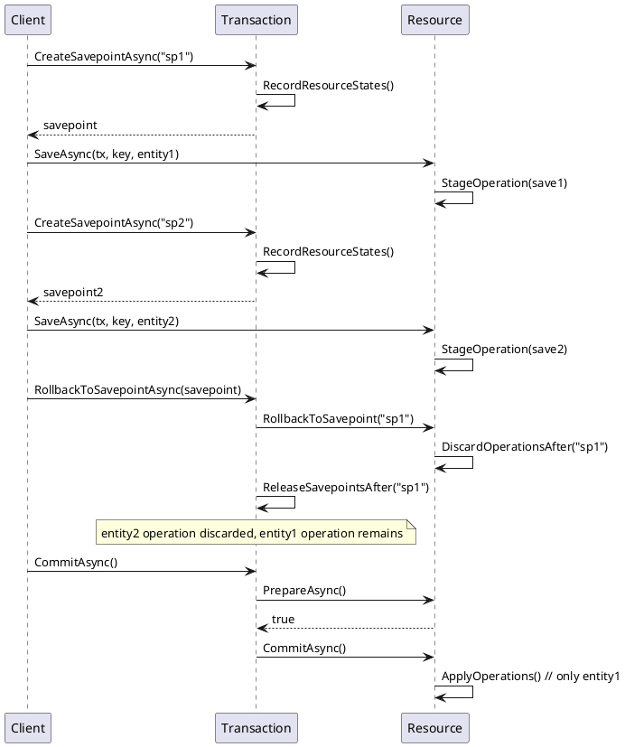
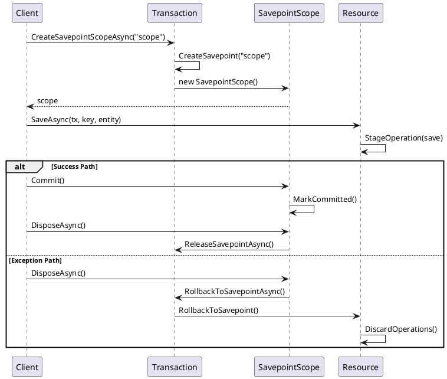
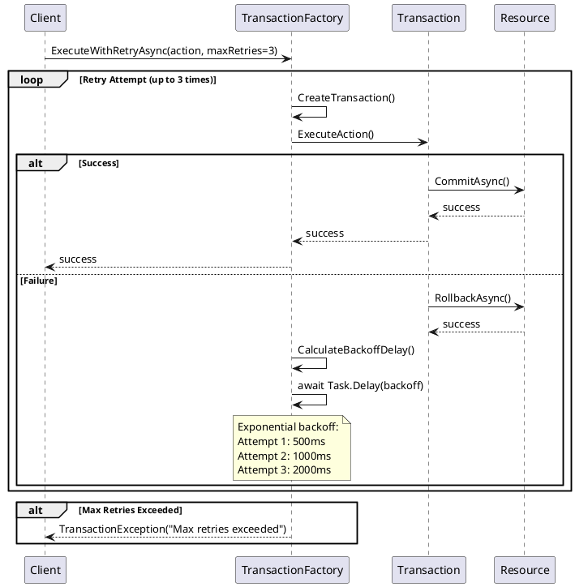

# Common.Tx - Transaction Management Library Design

## Overview

Common.Tx is a comprehensive .NET transaction management library implementing distributed transaction support with ACID guarantees. It provides a two-phase commit protocol for coordinating multiple resources, savepoint functionality for partial rollbacks, and seamless integration with modern .NET dependency injection patterns.

## Core Architecture

### Key Components

1. **Transaction Coordinator** (`TransactionCoordinator`) - Central orchestrator implementing two-phase commit
2. **Resource Management** (`ITransactionalResource`) - Interface for enlisting resources in transactions
3. **Repository Pattern** (`TransactionalRepository<T>`) - Transactional wrapper for data repositories
4. **Savepoint System** (`Savepoint`, `SavepointScope`) - Partial rollback capabilities
5. **Factory Pattern** (`TransactionFactory`) - Transaction lifecycle management
6. **Context Management** (`TransactionContext`) - Ambient transaction support

### Transaction States

```
Active → Preparing → Prepared → Committing → Committed
  ↓
RollingBack → RolledBack
  ↓
Failed/Timeout
```

## Transaction Logic Flow

### Two-Phase Commit Protocol

The library implements a robust two-phase commit (2PC) protocol:

**Phase 1 - Prepare:**
1. Transaction coordinator calls `PrepareAsync()` on all enlisted resources
2. Each resource validates its pending operations can be committed
3. Resources return true/false indicating readiness to commit
4. If any resource returns false, entire transaction rolls back

**Phase 2 - Commit/Rollback:**
1. If all resources prepared successfully, coordinator calls `CommitAsync()` on all resources
2. Each resource applies its pending operations to persistent storage
3. If any resource fails preparation, coordinator calls `RollbackAsync()` on all resources

### Resource Enlistment

Resources are automatically enlisted when operations are performed through `TransactionalRepository<T>`:

```csharp
// Automatic enlistment when using transactional repository
var repo = repositoryFactory.CreateTransactionalRepository(underlyingRepo);
await repo.SaveAsync(transaction, "key", entity); // Resource auto-enlisted
```

### Operation Staging

`TransactionalRepository<T>` stages all operations in memory until commit:
- **Read operations**: Provide transaction isolation using staged data
- **Write operations**: Queued as `TransactionOperation` objects
- **Optimistic concurrency**: Validates original values during prepare phase

## Usage Examples

### Basic Transaction Usage

```csharp
// Simple transaction with auto-commit
await transactionFactory.ExecuteInTransactionAsync(async transaction =>
{
    var repo = repositoryFactory.CreateTransactionalRepository(fileStore);
    
    // Stage operations - not yet persisted
    await repo.SaveAsync(transaction, "customer-1", customer);
    await repo.SaveAsync(transaction, "order-1", order);
    
    // Commit happens automatically at end of scope
});
```

### Manual Transaction Control

```csharp
// Explicit transaction management
using var transaction = transactionFactory.CreateTransaction();

try
{
    var customerRepo = repositoryFactory.CreateTransactionalRepository(customerStore);
    var orderRepo = repositoryFactory.CreateTransactionalRepository(orderStore);
    
    // Enlist resources by performing operations
    await customerRepo.SaveAsync(transaction, "customer-1", customer);
    await orderRepo.SaveAsync(transaction, "order-1", order);
    
    // Two-phase commit occurs here
    await transaction.CommitAsync();
}
catch (Exception)
{
    // Automatic rollback on exception
    await transaction.RollbackAsync();
    throw;
}
```

### Savepoint Usage

```csharp
using var transaction = transactionFactory.CreateTransaction();

// Main transaction operations
await customerRepo.SaveAsync(transaction, "customer-1", customer);

// Create savepoint before risky operations
var savepoint = await transaction.CreateSavepointAsync("before-complex-operation");

try
{
    // Complex operations that might fail
    await ProcessComplexBusinessLogic(transaction);
    
    // Release savepoint on success
    await transaction.ReleaseSavepointAsync(savepoint);
}
catch (BusinessLogicException)
{
    // Rollback to savepoint, keeping earlier operations
    await transaction.RollbackToSavepointAsync(savepoint);
    
    // Continue with alternative logic
    await ProcessAlternativeLogic(transaction);
}

await transaction.CommitAsync();
```

### Savepoint Scope (Auto-Rollback)

```csharp
using var transaction = transactionFactory.CreateTransaction();

await customerRepo.SaveAsync(transaction, "customer-1", customer);

// Auto-rollback scope
await using (var scope = await transaction.CreateSavepointScopeAsync("risky-operation"))
{
    // These operations will be rolled back if scope is not committed
    await ProcessRiskyOperations(transaction);
    
    // Explicitly commit scope to prevent rollback
    scope.Commit();
}

await transaction.CommitAsync();
```

### Retry Logic with Exponential Backoff

```csharp
// Automatic retry with exponential backoff
await transactionFactory.ExecuteWithRetryAsync(
    action: async transaction =>
    {
        await customerRepo.SaveAsync(transaction, "customer-1", customer);
        await orderRepo.SaveAsync(transaction, "order-1", order);
    },
    maxRetries: 3,
    retryDelay: TimeSpan.FromMilliseconds(500)
);
```

### Advanced Configuration

```csharp
var options = new TransactionOptions
{
    IsolationLevel = IsolationLevel.ReadCommitted,
    Timeout = TimeSpan.FromMinutes(5),
    ResourceOperationTimeout = TimeSpan.FromSeconds(30),
    AutoRollbackOnDispose = true,
    SavepointsEnabled = true
};

using var transaction = transactionFactory.CreateTransaction(options);
```

## PlantUML Sequence Diagrams

### Successful Transaction Flow



### Transaction Rollback Flow



### Savepoint Flow



### Auto-Rollback Scope Flow



### Retry with Exponential Backoff Flow



## Error Handling and Rollback Scenarios

### Automatic Rollback Triggers

1. **Transaction Timeout**: Configurable timeout with automatic rollback
2. **Resource Prepare Failure**: Any resource returning false during prepare phase
3. **Resource Commit Failure**: Unexpected exceptions during commit phase
4. **Dispose Without Commit**: When `AutoRollbackOnDispose = true`
5. **Unhandled Exceptions**: In transaction scopes or retry logic

### Rollback Safety Guarantees

- **Idempotent Operations**: Rollback can be called multiple times safely
- **Exception Isolation**: Rollback failures don't mask original exceptions
- **Parallel Rollback**: All resources rolled back concurrently for performance
- **State Consistency**: Transaction state carefully managed during rollback
- **Resource Cleanup**: All enlisted resources properly cleaned up

### Exception Hierarchy

```csharp
TransactionException
├── TransactionTimeoutException
├── TransactionAbortedException
├── TransactionCommitException
├── TransactionRollbackException
└── SavepointException
    ├── SavepointNotFoundException
    └── SavepointRollbackException
```

### Error Recovery Patterns

```csharp
// Comprehensive error handling
try
{
    await transactionFactory.ExecuteInTransactionAsync(async transaction =>
    {
        await businessLogic.ExecuteAsync(transaction);
    });
}
catch (TransactionTimeoutException ex)
{
    // Handle timeout - possibly retry with longer timeout
    logger.LogWarning("Transaction timed out: {Message}", ex.Message);
    await RetryWithLongerTimeout();
}
catch (TransactionCommitException ex)
{
    // Handle commit failure - data may be in inconsistent state
    logger.LogError("Transaction commit failed: {Message}", ex.Message);
    await NotifyAdministrators(ex);
}
catch (TransactionException ex)
{
    // Handle general transaction failure
    logger.LogError("Transaction failed: {Message}", ex.Message);
    await HandleBusinessLogicFailure(ex);
}
```

## Performance Considerations

### Optimizations

- **Async/Await First**: Full async implementation with proper `ConfigureAwait(false)`
- **Parallel Operations**: Concurrent prepare/commit/rollback across resources
- **Memory Management**: Efficient operation staging with minimal allocations
- **File I/O Optimization**: Custom file extensions with optimized buffer sizes
- **Thread Safety**: Lock-free operations where possible using `ConcurrentDictionary`

### Best Practices

1. **Keep Transactions Short**: Minimize transaction duration to reduce lock contention
2. **Batch Operations**: Group related operations within single transaction
3. **Use Savepoints Sparingly**: Only when partial rollback is truly needed
4. **Configure Timeouts**: Set appropriate timeouts based on operation complexity
5. **Monitor Performance**: Use logging and metrics to track transaction performance

## Dependency Injection Integration

### Microsoft.Extensions.DependencyInjection

```csharp
// Program.cs or Startup.cs
services.AddTransactionSupport();

// Usage in services
public class OrderService
{
    private readonly ITransactionFactory _transactionFactory;
    private readonly ITransactionalRepositoryFactory _repositoryFactory;
    
    public OrderService(
        ITransactionFactory transactionFactory,
        ITransactionalRepositoryFactory repositoryFactory)
    {
        _transactionFactory = transactionFactory;
        _repositoryFactory = repositoryFactory;
    }
    
    public async Task ProcessOrderAsync(Order order)
    {
        await _transactionFactory.ExecuteInTransactionAsync(async transaction =>
        {
            var orderRepo = _repositoryFactory.CreateTransactionalRepository(_orderStore);
            var inventoryRepo = _repositoryFactory.CreateTransactionalRepository(_inventoryStore);
            
            await orderRepo.SaveAsync(transaction, order.Id, order);
            await inventoryRepo.UpdateAsync(transaction, order.ProductId, inventory);
        });
    }
}
```

### Unity Container Support

```csharp
// Unity configuration
container.AddTransactionSupport();

// With custom options
container.RegisterTransactionServices(options =>
{
    options.DefaultTimeout = TimeSpan.FromMinutes(2);
    options.DefaultIsolationLevel = IsolationLevel.ReadCommitted;
});
```

## Recommendations

### 1. ITransaction.cs / Transaction.cs (Implementation):

- Idempotency: Ensure CommitAsync and RollbackAsync are idempotent (safe to call multiple times after the first effective call).
- IAsyncDisposable: Ensure proper implementation for await using.
- State Management: Maintain a clear internal state (e.g., Pending, Committed, RolledBack, Aborted) and prevent invalid operations based on state.
- Error Handling: Throw specific TransactionException subtypes for different failure modes.
- Logging: Implementations of CommitAsync/RollbackAsync are good places to log detailed information about transaction outcomes, especially failures.

### 2. ITransactionFactory.cs / TransactionFactory.cs:

- Options Handling: Correctly interpret TransactionOptions (e.g., isolation level, timeout) when creating transactions.
- Resource Management: Ensure any underlying resources used by transactions are managed efficiently.

### 3. TransactionContext.cs:

- AsyncLocal<ITransaction>: This is the standard way to manage ambient transactions across async/await calls. Ensure it's used correctly.
- Nesting: Define clear behavior for nested transactions if supported (e.g., true nesting, joining the ambient transaction, or throwing). The current extensions manage a simple restoration of the previous context.

### 4. TransactionOptions.cs:

- Immutability: Consider making TransactionOptions immutable or using a builder pattern for clarity and safety.
- Defaults: Provide sensible default values.

### 5. TransactionException.cs (and subtypes):

- Hierarchy: A clear exception hierarchy (e.g., TransactionAbortedException, TransactionTimeoutException, DeadlockVictimException all inheriting from TransactionException) aids in specific error handling.
- Information: Include relevant transaction state or error codes in exceptions.

### 6. Savepoint.cs / SavepointScope.cs:

- SavepointScope: Ensure Dispose correctly rolls back to the savepoint if the scope was not explicitly completed/released.
- ITransaction Savepoint Methods: CreateSavepointAsync, RollbackToSavepointAsync, ReleaseSavepointAsync should be robust and handle edge cases (e.g., savepoint not found).

### 7. IRepository.cs / ITransactionalRepositoryFactory.cs / TransactionalRepository.cs:

- Enlistment: The TransactionalRepository wrapper should reliably enlist operations within the TransactionContext.Current transaction.
- Decoupling: Keep the core IRepository interface free of transaction concerns; the transactional behavior should be added by the wrapper/factory.

### 8. Overall Code Quality:

- XML Documentation: Maintain comprehensive XML comments for all public APIs.
- Unit Testing: Thorough unit tests are crucial, covering success paths, various failure modes, rollback scenarios, retry logic (including cancellation), and savepoint behavior. Test interactions with TransactionContext.
- Thread Safety: Analyze and ensure thread safety where necessary, especially if shared state is involved (though AsyncLocal helps isolate async flows).
- Performance: Be mindful of the performance overhead of transaction management, especially for short-lived or frequent operations.